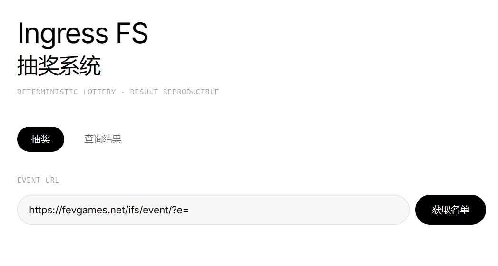

# Ingress FS 抽奖系统

用于 Ingress First Saturday 活动的确定性抽奖工具。自动从 fevgames.net 爬取签到 Agent 名单，进行公平、可复现的随机抽奖。



## 功能

- **自动爬取名单** — 输入 fevgames.net IFS 活动页面 URL，自动解析 Agent 名单及阵营
- **确定性抽奖** — 使用 Mulberry32 PRNG + Fisher-Yates 洗牌算法，同一名单 + 同一 Seed 结果 100% 可复现
- **结果存档** — 抽奖结果存入 Cloudflare D1 数据库，按抽奖 ID 随时查询

## 技术栈

| 层     | 技术                            |
| ------ | ------------------------------- |
| 前端   | React + TailwindCSS (Vite 构建) |
| 后端   | Hono (Cloudflare Workers)       |
| 数据库 | Cloudflare D1 + Drizzle ORM     |
| 验证   | Zod                             |
| 部署   | Cloudflare Workers + Wrangler   |

## 使用方法

### 1. 抽奖

1. 输入活动页面 URL（如 `https://fevgames.net/ifs/event/?e=`）
2. 点击「获取名单」，系统自动爬取并展示 Agent 列表
3. 输入中奖人数（可选：输入 Seed 用于复现验证）
4. 点击「开始抽奖」查看结果

### 2. 查询

切换到「查询结果」标签，输入抽奖 ID 即可查看历史抽奖记录。

### 3. 复现验证

记录抽奖结果中的 Seed，在抽奖页使用相同名单 + 相同 Seed 重新抽奖，结果完全一致。

## 本地开发

```bash
# 安装依赖
bun install

# 构建前端
bun run build

# 启动本地开发服务器
bun run dev
```

## 部署

```bash
# 创建 D1 数据库（首次）
wrangler d1 create lottery-db

# 生成 migration
bun run db:generate

# 应用 migration 到远程数据库
bun run db:migrate:remote

# 构建并部署
bun run deploy
```

部署后需在 `wrangler.toml` 中更新 `database_id` 为实际值。

## 项目结构

```
src/
├── index.ts           # Hono 路由 + Cloudflare Worker 入口
├── db.ts              # Drizzle ORM Schema + D1 操作
├── scraper.ts         # fevgames 页面爬取与解析
├── rng.ts             # 确定性伪随机数生成器
└── frontend/          # React 前端
    ├── App.tsx
    └── components/
        ├── UrlInput.tsx
        ├── AgentList.tsx
        ├── LotteryForm.tsx
        ├── LotteryResult.tsx
        └── ResultQuery.tsx
```

## License

MIT
